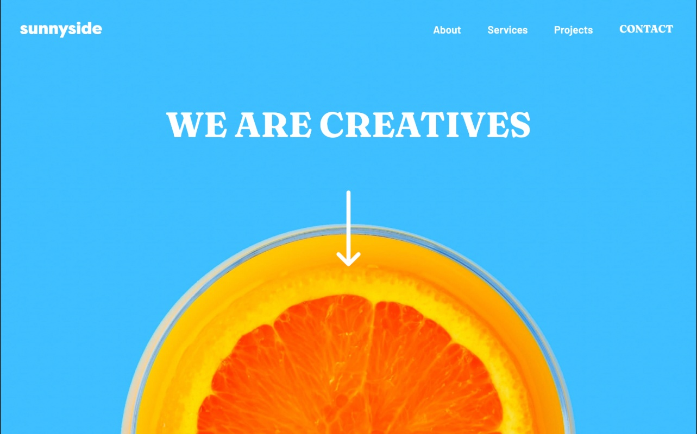
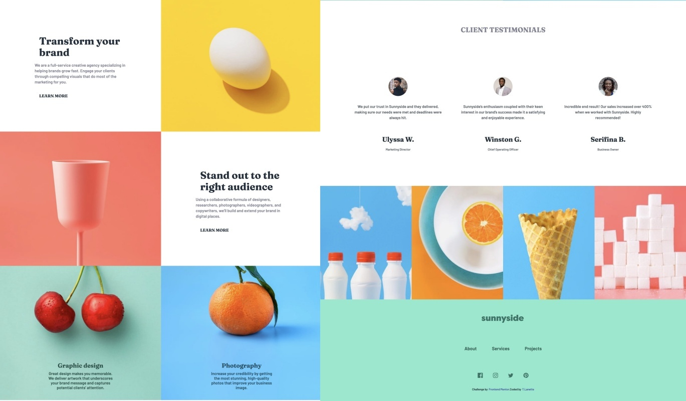
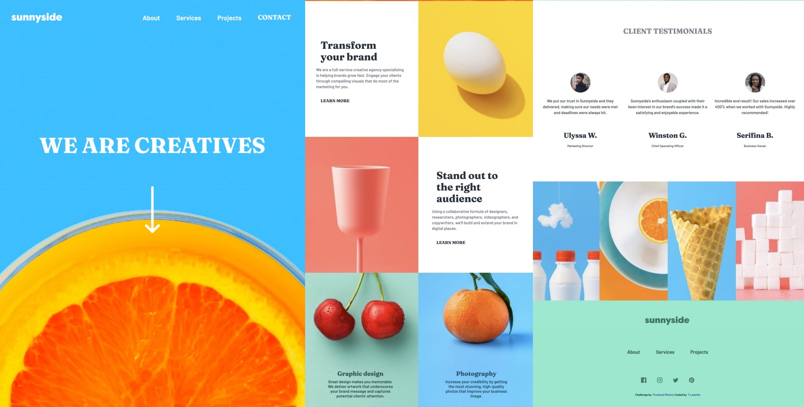
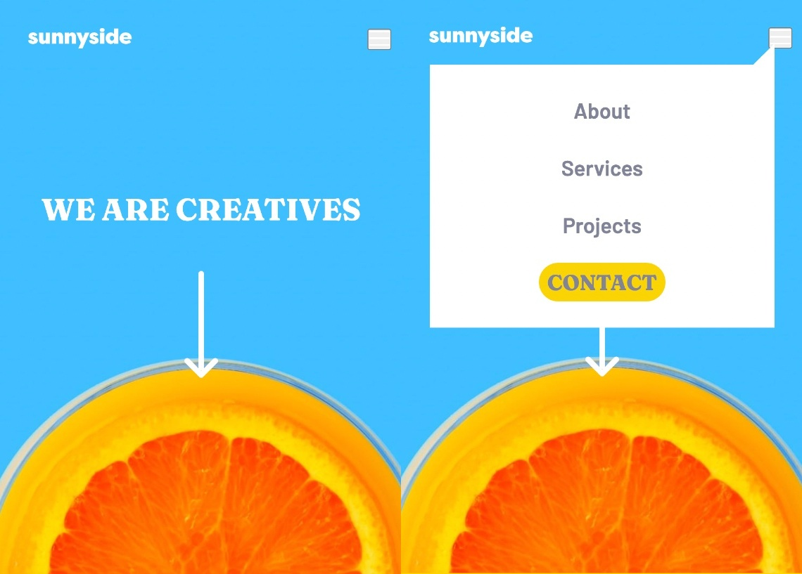
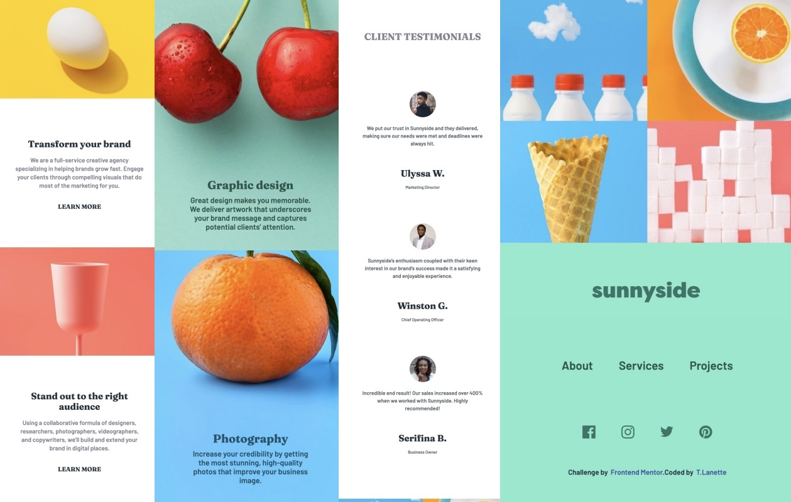

# Frontend Mentor - Sunnyside agency landing page solution

This is a solution to the [Sunnyside agency landing page challenge on Frontend Mentor](https://www.frontendmentor.io/challenges/sunnyside-agency-landing-page-7yVs3B6ef). Frontend Mentor challenges help you improve your coding skills by building realistic projects.

## Table of contents

- [Overview](#overview)
  - [The challenge](#the-challenge)
  - [Screenshot](#screenshot)
  - [Links](#links)
- [My process](#my-process)
  - [Built with](#built-with)
  - [What I learned](#what-i-learned)
  - [Continued development](#continued-development)
  - [Useful resources](#useful-resources)
- [Author](#author)
- [Acknowledgments](#acknowledgments)

## Overview

### The challenge

Users should be able to:

- View the optimal layout for the site depending on their device's screen size
- See hover states for all interactive elements on the page

### Screenshot

#### Desktop Header & Page



---



---

#### Tablet: iPad Pro Header and Page



---

#### Mobile: Nokia Header and Page



---



---

I have included five screen shots of three devices:

- Nokia N9 (480x854)
- iPad Pro (1024x1366)
- MacBook Air (1440x900)

I used the [Responsively](https://opencollective.com/responsively) app while coding. They have a great screen-shot function. I also used [Photoscape app](http://www.photoscape.org/ps/main/index.php) to edit and combine the screen shots.

### Links

- Solution URL: [Add solution URL here](https://your-solution-url.com)
- Live Site URL: [Add live site URL here](https://your-live-site-url.com)

## My process

### Built with

- Semantic HTML5 markup
- CSS custom properties
- Flexbox
- CSS Grid
- Mobile-first workflow
- [Sass](https://sass-lang.com/) - I love using SASS!

### What I learned

I learned that sometimes less is more and that I needed to trust CSS Grid and Flexbox for positioning my layout. I tend to rely on padding and margin to place elements. I need to practice internalizing positions (absolute and relative) and trusting the power of Grid and Flexbox. I also found an example of how to change the hover color for icons. I used invert color before with an svg. This was useful with an image. I included the code snippet below:

```css
img:hover {
	filter: brightness(0) invert(1);
}
```

### Continued development

Position, position, position. That will always be me area for development. I always get caught up in placement and how to organize my page elements. This project was great for reinforcing CSS Grid and Flexbox.

### Useful resources

- [PX to EM Converter](https://nekocalc.com/px-to-em-converter) - This helped me to make my font sizes more responsive.
- [Example resource 2](https://www.example.com) - This is an amazing article which helped me finally understand XYZ. I'd recommend it to anyone still learning this concept.
- [Example resource 2](https://www.example.com) - This is an amazing article which helped me finally understand XYZ. I'd recommend it to anyone still learning this concept.

## Author

- Website - [T.Lanette Pollard](https://tlp-portfolio.vercel.app/)
- Frontend Mentor - [@TLanetteRose](https://www.frontendmentor.io/profile/TLanetteRose)
- Twitter - [@TpLanetteNBCT](https://twitter.com/TpLanetteNBCT)

## Acknowledgments

This is where you can give a hat tip to anyone who helped you out on this project. Perhaps you worked in a team or got some inspiration from someone else's solution. This is the perfect place to give them some credit.

**Note: Delete this note and edit this section's content as necessary. If you completed this challenge by yourself, feel free to delete this section entirely.**
